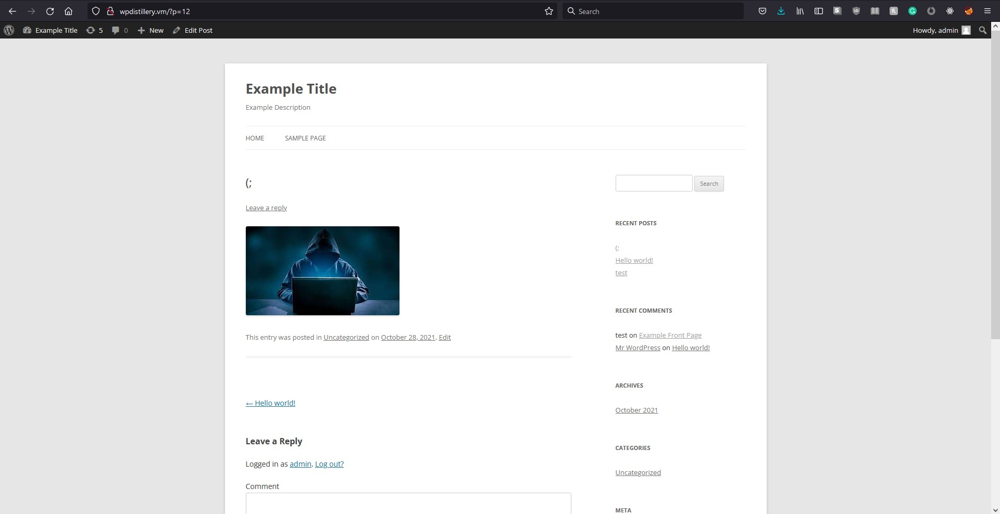

# Project 7 - WordPress Pentesting

**Time Spent:** 10 hours

## Objective
Find, analyze, recreate, and document **five vulnerabilities** affecting an old version of WordPress.

---

## Table of Contents
- [Pentesting Report](#pentesting-report)
  - [1. WordPress < 5.1.1 / CVE-2019-9787: CSRF](#1-wordpress--511--cve-2019-9787-csrf)
  - [2. User Enumeration](#2-user-enumeration)
  - [3. XSS Media](#3-xss-media)
- [Assets](#assets)
- [Resources](#resources)
- [Notes](#notes)
- [License](#license)

---

## Pentesting Report

### 1. WordPress < 5.1.1 / CVE-2019-9787: Cross-Site Request Forgery (CSRF)
> **Note:** The summary currently lists the vulnerability type as **XSS**. Please verify whether this should be CSRF or XSS.

- **Summary:**
  - **Vulnerability Type:** XSS *(subject to clarification)*
  - **Tested Version:** 4.0
  - **Fixed in Version:** 5.1.1

- **GIF Walkthrough:**
  

- **Steps to Recreate:**
  1. **Login and navigate:**  
     Log in and open a page.  
     
  2. **Inject the script:**  
     Enter the script in the comment section.  
     
  3. **Submit the comment:**  
     Post the comment and observe the effect.  
     

- **Affected Source Code:**
  

---

### 2. User Enumeration

- **Summary:**
  - **Vulnerability Type:** User Enumeration
  - **Tested Version:** 4.0
  - **Fixed in Version:** *Not fixed*

- **GIF Walkthrough:**
  

- **Steps to Recreate:**
  1. **Access the login page:**  
     
  2. **Test with credentials:**  
     Enter "admin" as the username and a random password.  
     
  3. **Observe error messages:**  
     - If the user exists, WordPress returns an incorrect password error.  
         
     - If the user does not exist, WordPress returns an invalid username error.  
       

---

### 3. XSS Media

- **Summary:**
  - **Vulnerability Type:** XSS
  - **Tested Version:** 4.0
  - **Fixed in Version:** 5.1.2

- **GIF Walkthrough:**
  

- **Steps to Recreate:**
  1. **Access the admin console:**  
     Create or edit a page.  
     
  2. **Add media:**  
     Click on "Add Media".  
     
  3. **Inject XSS script:**  
     Select an image, add the XSS script in the description, and change the link to "attachment page".  
     
  4. **Trigger the vulnerability:**  
     Post the changes, view the page, and click the image.  
     
  5. **Confirmation:**  
     

- **Affected Source Code:**
  - [View Source Code](https://core.trac.wordpress.org/browser/tags/version/src/source_file.php)

---

## Assets

- **XSS Cheatsheet:**  
  [OWASP XSS Filter Evasion Cheat Sheet](https://cheatsheetseries.owasp.org/cheatsheets/XSS_Filter_Evasion_Cheat_Sheet.html/)

---

## Resources

- [WordPress Source Browser](https://core.trac.wordpress.org/browser/)
- [WordPress Developer Reference](https://developer.wordpress.org/reference/)
- GIFs created with [Screentogif](https://www.screentogif.com/).

---

## Notes

- **Challenges Encountered:**
  - Bitdefender and Microsoft antivirus blocked payloads even after they were disabled.
  - Limited permissions: No access to view plugins or the PHPmyadmin database.

---

## License

    Copyright [2021] [Alejandro Bravo]

    Licensed under the Apache License, Version 2.0 (the "License");
    you may not use this file except in compliance with the License.
    You may obtain a copy of the License at

        http://www.apache.org/licenses/LICENSE-2.0
